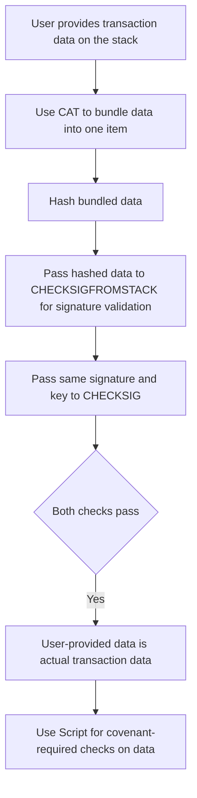

# manim-learning

### Installation

Follow: https://docs.manim.community/en/stable/installation/linux.html

TODO: Install a docker container for more portability

## How to run


### Simple Bitcoin Transactions with voiceover
For the simple bitcoin transactions, you can run
This is a bit heavy because it requires voiceover libraries too


```
manim -pql simpletransactionintro.py IntroduceBitcoinTransactions 
```

### Simple Covenants

This tries to adapt the first part of Andrew Poelstra's blog post on  [Cat and Schnorr Tricks](https://medium.com/blockstream/cat-and-schnorr-tricks-i-faf1b59bd298).



```
manim -pql covenants.py IntroduceCheckSigFromStack
```

output: 


